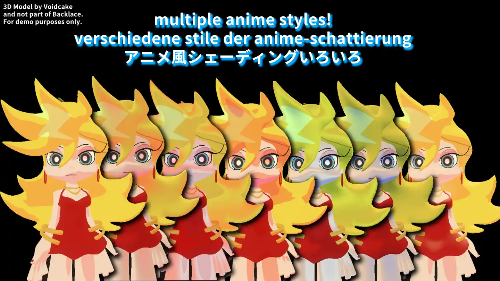
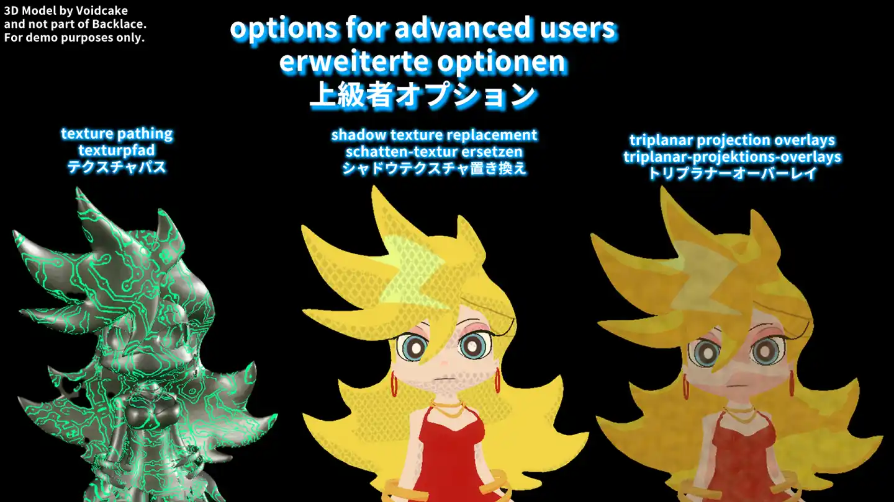
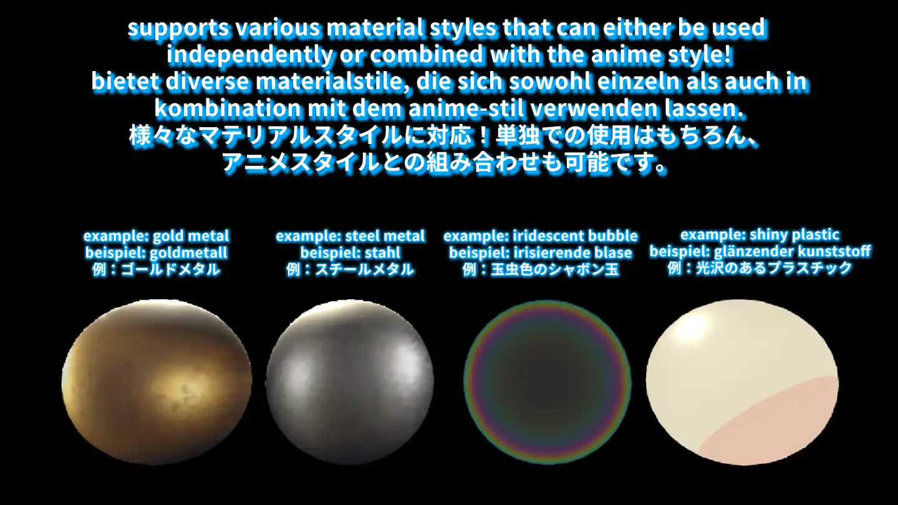
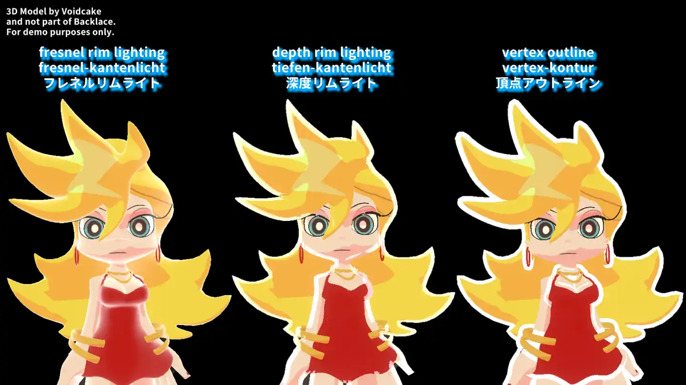
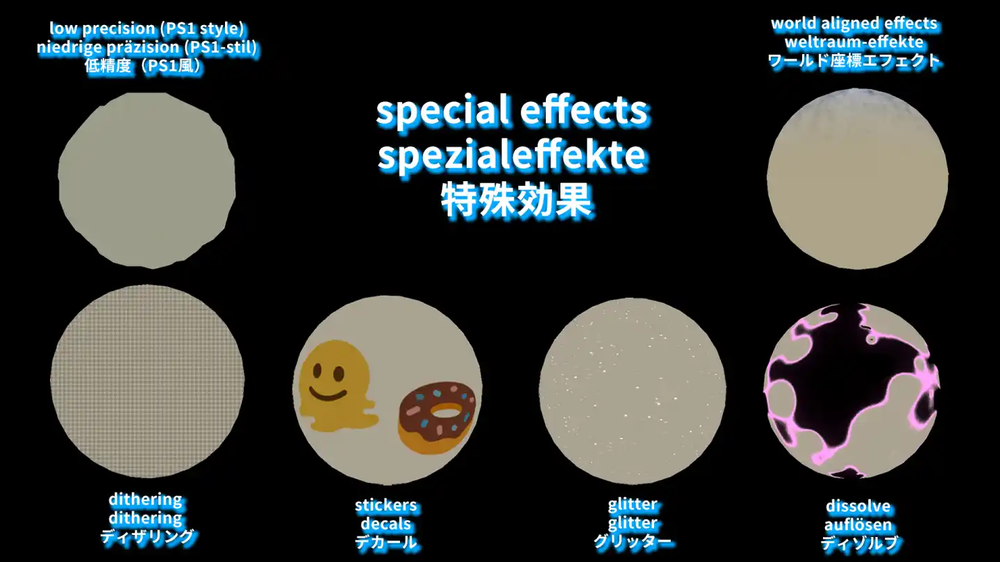
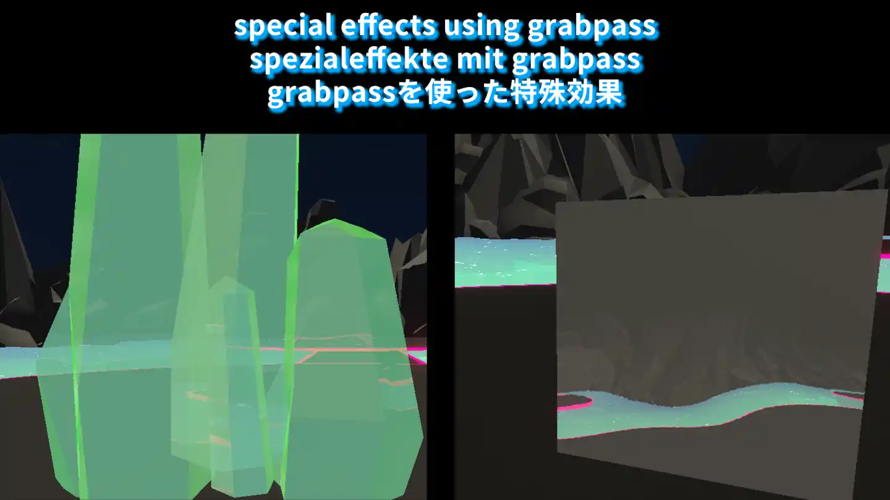
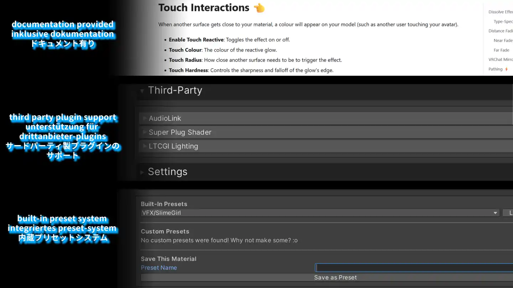

  

---

> *High heels, cute face, all the boys, they want a taste~*

Backlace 🎀 is a versatile anime (also called "toon", "cel shaded", or "npr") shader for Unity and VRChat. Backlace is packed with a wide range of features- from anime character shading, to screen-space rim lighting, to procedural glitter. Get started with a single click for a typical fully-lit anime character or dive deep into the advanced settings like Pathing and Refraction! (─‿‿─)♡

**Latest Release:** 1.8.5 — see the [changelog](CHANGELOG.md) if you wish (｀・ω・´)ゞ
 
**Supported Platforms:** Unity Built-in Render Pipeline (BiRP), VRChat, Beatsaber, MateEngine, and more!

## Features 🍒
- **Core Features:**
	- Render Settings/Presets, Alebdo, Normal (Texture/Derived), Emission
	- Texture Stitching, Texture Post-Processing, Decals
	- Vertex and UV Manipulation, UV Sets
	- Easy VRC Fallback Control
 - **Lighting:**
	 - Models: Backlace (Default), PoiCustom, OpenLit, Standard, Mochie
	 - Direction Modes: Backlace (Default), Forced, View Direction
	 - Diffuse Modes: PBR, Ramp Toon, Anime Toon
	 - Anime Extra Features: Ambient Gradient, Tint Mask Source, SDF Shadows
- **Specular:** Vertex Specular, PBR Specular, Anisotropic, Toon, Hair, Cloth
- **Stylise:** Fresnel Rim, Depth Rim, Matcap, Cubemap, Clearcoat, Subsurface Scattering, Shadow Textures, Detail Mapping, Shadow Mapping
- **Effects:** Dissolve, Distance Fading, Mirror Detection, Pathing, Glitter, Iridescence, Parallax Mapping (Fast/Fancy UV, Layered, Interior), World Aligned Textures, Dithering, Touch Interactions, Flatten Model, Vertex Distortion (Distort and Glitch), Low-Precision (PS1), Refraction, (Fake) Screen Space Reflections
- **Shader Variants:** Default, Grabpass, Outline, All
- **Legacy Mode** can optionally be enabled to support older hardware (Shader Model 3.0)
- **Third Party Support:** AudioLink, Super Plug Shader, LTCGI Lighting
- **Custom UI** built with my Dazzle library! It's quite pretty...
- **Compact Shader Generation** with my Premonitions library!
- **Presets** system built in, alongside custom preset saving (and tonnes of pre-made presets! from slime girls to metallic robots)
- **Optimised** with local shader features rather than global keywords
- **9 Languages!** English, German, Japanese, French, Chinese, Spanish, Korean, Russian, and Cat :)
- **Fully documented** on [my website](https://www.luka.moe/docs/backlace) and plenty of inline comments to help out ^^

<h3>Some Preview Images (ღ˘⌣˘ღ)</h3>

| Caption | Preview |
|---|---|
| Anime Shading |  |
| Advanced Features |  |
| Various Materials |  |
| Outline Styles |  |
| Special Effects |  |
| Grabpass Features |  |
| UI, Docs, and More |  |

## Where Backlace Is Used 🍰
This section will be updated when I make things with it! If you make something with Backlace ~ whether a game or shader ~ please let me know so I can add it here! ♡＾▽＾♡

- The official distribution of Backlace itself! You can find it on [Gumroad](https://kleineluka.gumroad.com/l/backlace), [Jinxxy](https://jinxxy.com/luka/backlace), [Booth.pm](https://lukasong.booth.pm/items/7551840), and [Payhip](https://payhip.com/b/71i3E) (and on this repo).

 

If you wish to **make your own shader** with Backlace, please see [Contributing to Backlace](BUILDING.md) for more information! This is unnecessary if you just want to use Backlace as-is in your projects (ex. game developers, avatar creators, or world builders). ( *︾▽︾)

## License 🍷
Backlace is licensed under the Backlace License (Version 1.5). Please see the `LICENSE.md` file for the full terms.

**For Game Developers, VRChat Creators, and General Users —**
- You’re free to use Backlace in any project (personal or commercial) at no cost.
- Please give credit to “Backlace Anime Shader” somewhere in your project, whether that be in your README, credits, or simply in your code. You don't need to be super formal about it or fly a banner, I just enjoy seeing my what my work is used in! (◕‿◕)♡

**For Developers Building Off of Backlace —**
- You’re free to use Backlace in any project (personal or commercial) at no cost.
- Anything you sell with Backlace must be transformative (adding significant new features or creativity). You can’t just rebrand or resell Backlace as-is.
- You must credit “Backlace” somewhere visible in your shader's user interface (like a credits section or footer) with a link to the official GitHub page.
- Please avoid modifying/redistributing files in the `Editor` and `Processor` folders in your project as those are not intended to be built off of. This doesn't apply to anybody using Backlace as-is in their projects.

If you’re unsure whether your use fits the license or just want to talk about it, feel free to reach out! 💗

## Attributions ❤️‍🔥
- This shader was originally a fork of the [Toony Standard Rebuild](https://github.com/VRLabs/Toony-Standard-Rebuild) shader by VRLabs, which is under the MIT license. However, essentially all of that code has been replaced, removed, or rewritten. **No bugs for Backlace should be reported to them.**
- Various lighting modes are derived from other projects, specifically [Poiyomi Toon](https://github.com/poiyomi/PoiyomiToonShader), [lilToon/OpenLit](https://github.com/lilxyzw/lilToon), and [Mochies Unity Shaders](https://github.com/MochiesCode/Mochies-Unity-Shaders/). Thesse are all under the MIT license and code references are limited to lighting modes with those names (ex. \"Poi Custom\", \"OpenLit\", \"Mochies\").
- The \"Flatten Model\" effect is inspired directly by [Lyuma's Waifu2D Shader](https://github.com/lyuma/LyumaShader), which is under the MIT license. Please note Backlace's implementation is simplified and their code is better if a flat model is *purely* the goal of your project!
- Original inspiration for the Raymarched SSR feature came from [orel1's SSR module](github.com/orels1/orels-Unity-Shaders), which is an implementation of [Mochie's](https://github.com/MochiesCode/Mochies-Unity-Shaders/) fork of ERROR.mdl's SSR. Both are under MIT licenses. While Backlace's idea stemmed from there, the implementation here is much simpler and modified.
- AudioLink features, and a lot of the boilerplate code in `Backlace_AudioLink.cginc`, are from [AudioLink](https://github.com/llealloo/audiolink), which is under a modified MIT license.
- Third-party features such as [LTCGI](https://github.com/PiMaker/ltcgi) and [Super Plug Shader](https://vrcfury.com/sps/) are unassociated projects, under their own licenses, and require separate installation.
- Default textures (ex. ramps and noises) are from a variety of sources online, notably [Perlin Noise Maker](http://kitfox.com/projects/perlinNoiseMaker/), [OpenGameArt](https://opengameart.org/), and [Booth Matcap Pack 2](https://booth.pm/ja/items/5755167).
- The name is inspired by a certain vulgar and promiscious angel. (｡♥‿♥｡)