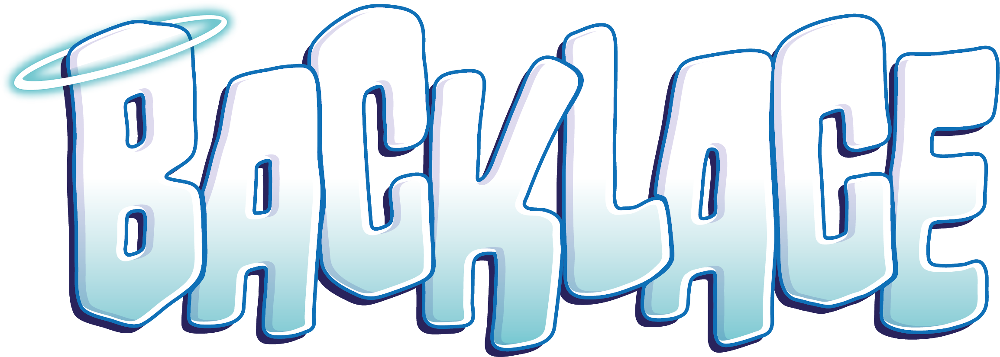

  

---

> *Remember that time when I told you to relax? You need some inner-#!&$&%!-peace!*

Backlace is a versatile anime (as well as toon/pbr) shader for Unity and VRChat. Despite mainly serving as a starting point for future projects, you will find that Backlace is packed with a wide range of features- from anime character shading, to screen-space rim lighting, to procedural glitter.

## Features 🌈
Backlace comes in three variants: Default, Grabpass, and Outline. While Default has most features, some features are exclusive to the other two variants in order to save on performance (ex. not rendering an additional outline pass and not capturing the screen as a grabpass texture).

  
<b>Shader Features</b>

- Basic Texture Features (Albedo, Normal, etc.)
- Multiple Lighting Models (Backlace, PoiCustom, OpenLit, Standard, Mochie)
- Various Specular Modes (PBR, Anisotropic, Toon, Hair, Cloth)
- Various Diffuse Modes (PBR, Ramp Toon, Anime Toon)
- Light Direction Modes (Backlace, Forced, View Direction)
- Vertex Manipulation
- UV Manipulation
- UV Effects (Triplanar, Screenspace, Flipbook, Flowmap)
- Emission
- Light Limiting
- Rim Lighting
- Clearcoat
- Matcap
- Decal (2 Slots)
- Texture Post-Processing
- Cubemap Reflection
- Parallax Mapping (Fasty and Fancy)
- Subsurface Scattering
- Detail Mapping
- Dissolve Effect
- Pathing
- Depth Rim Lighting
- Shadow Map
- Glitter
- Distance Fading
- Iridescence
- Shadow Textures
- Flatten Model (2D Effect)
- World Aligned Textures
- VRChat Mirror Detection
- Touch Interactions
- Vertex Distortion
- Refraction (Grabpass Variant Only)
- Fake Screen Space Reflections (Grabpass Variant Only)
- Outline (Outline Variant Only)

  
<b>Third-Party Features</b>

- AudioLink
- Super Plug Shader

  
<b>Material Presets</b>

Some preset values for the shader are also provided to help give you a starting point for various (typically more complex) materials. Some require specific variants to work.
- Fabric (Any Variant)
- Wet (Fun Variant)
- Slime (Fun Variant)
- Crystal (Fun Variant)

## Where Backlace Is Used 🌨️
This section will be updated when I make things with it!

## Building Off Of Backlace 🫧

> [!NOTE] 
> This section is for developers who want to build off of Backlace. If you just want to use Backlace on your avatar, game, etc., you can skip this section. ( \*︾▽︾)

Backlace is split into a lot of CGInclude files to make it easier to edit, build off of, and maintain.
- You will find most code for the Forward Base and Add pass in `Backlace_Forward.cginc`, with the vertex and fragment shader for the Forward passes in `Backlace_Vertex.cginc` and `Backlace_Fragment.cginc` respectively.
- Additional passes, such as Outline, Shadow, Meta, are in their own files (`Backlace_Outline.cginc`, `Backlace_Shadow.cginc`, and `Backlace_Meta.cginc`).
- If you wish to include a geometry shader, there is a template in `Backlace_Geometry.cginc` that you can use.
- For anything related to lighting modes, you will find that in `Backlace_Lighting.cginc`, while anything related to surface properties and shading is in `Backlace_Shading.cginc`.
- Fun variant effects are in `Backlace_Effects.cginc`.
- Universal helper files exist, such as `Backlace_Keywords.cginc`, `Backlace_Properties.cginc`, and `Backlace_Universal.cginc`.
- Third-party code (such as AudioLink) go into their own files, such as `Backlace_AudioLink.cginc`.

What you edit depends on what you want to do. A good place to start is with `Backlace_Fragment.cginc` and working backwards from there to see what you need to change.

## License ✨
Anything in the [Editor](https://github.com/kleineluka/backlace/tree/main/Resources/Luka_Backlace/Editor) folder in this repository is not to be used in your transformative works. This code is provided as a demo UI, and has all of my socials and metadata hard-coded, so you do not want to redistribute this anyways. If you are redistributing Backlace as your primary shader and not making your own shader, you can of course include the editor as-is. (tl;dr- if you want to build off Backlace, make your own editor, otherwise ignore this!)

The shader itself is under the **MIT license**, with the additional clauses that (1) you must credit Backlace/KleineLuka in your project if you use Backlace in any capacity and (2) the editor exemption stated above. 

An example credit could be, for example, "My shader was built off of Backlace (hyperlinked to this repository) by KleineLuka."

## Attributions 🎨
- This shader was originally a fork of the [Toony Standard Rebuild](https://github.com/VRLabs/Toony-Standard-Rebuild) shader by VRLabs, which is under the MIT license. However, most of the original code has been rewritten or removed, so don't complain there if there are issues here.
- Various lighting modes are derived from other projects, specifically [Poiyomi Toon](https://github.com/poiyomi/PoiyomiToonShader), [lilToon/OpenLit](https://github.com/lilxyzw/lilToon), and [Mochies Unity Shaders](https://github.com/MochiesCode/Mochies-Unity-Shaders/). Thesse are all under the MIT license and usages are limited to lighting modes with those names (ex. \"Poi Custom\", \"OpenLit\", \"Mochies\").
- The 2D effect in the Fun variant is inspired directly by [Lyuma's Waifu2D Shader](https://github.com/lyuma/LyumaShader), which is under the MIT license. Although  please note it is simplified and their code is better if a flat model is purely the goal of your project!
- AudioLink features, and a lot of the boilerplate code in `Backlace_AudioLink.cginc`, are from [AudioLink](https://github.com/llealloo/audiolink), which is under a modified MIT license.