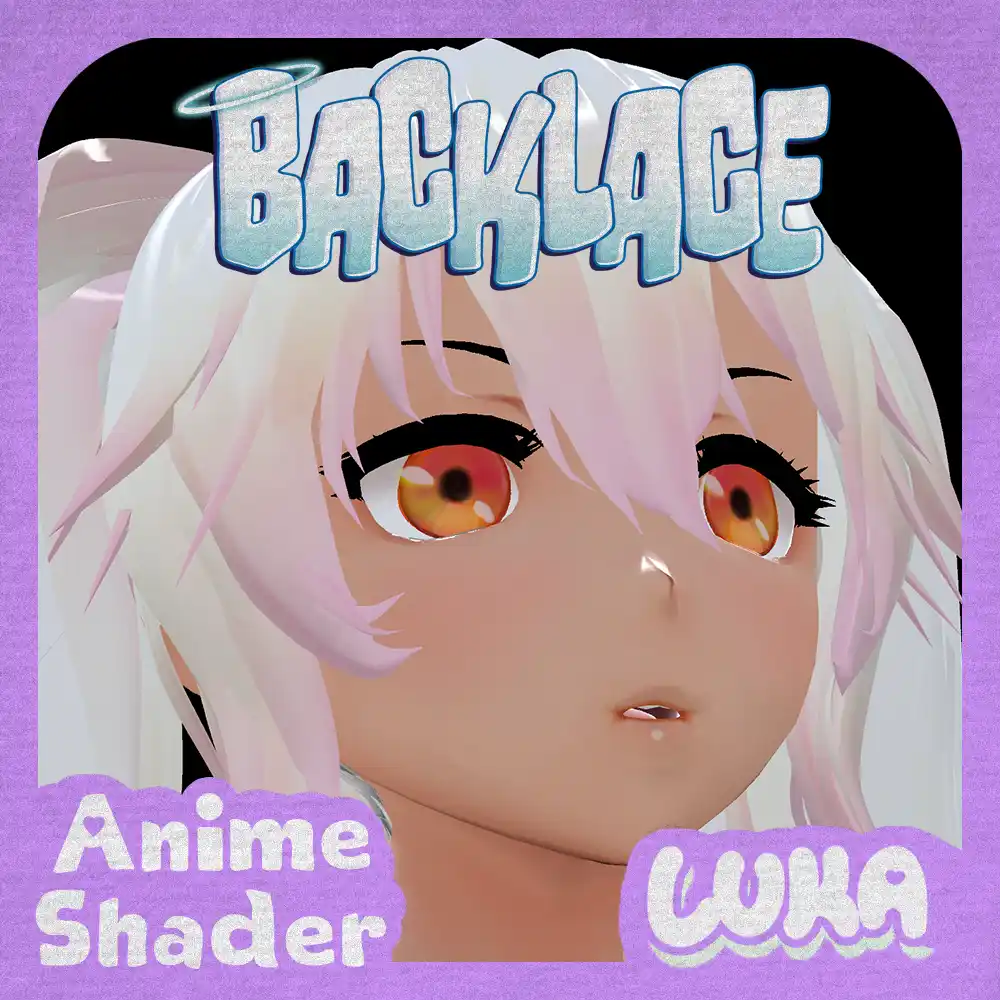
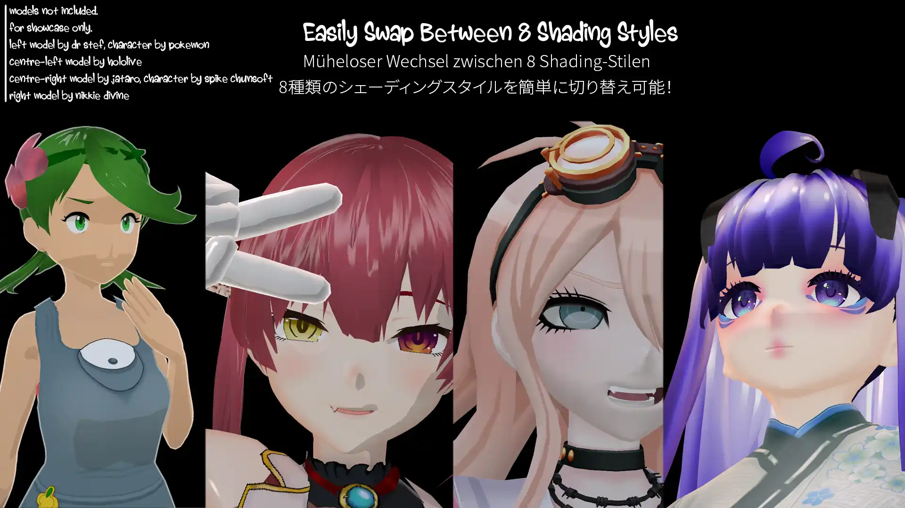
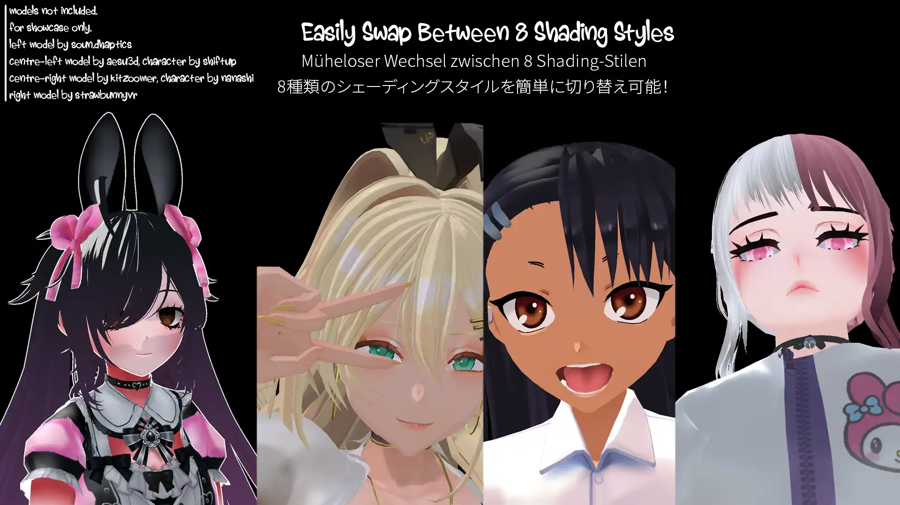
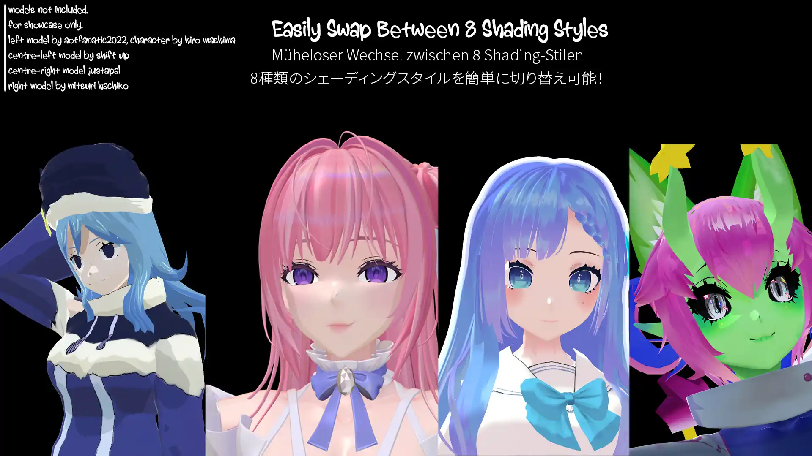
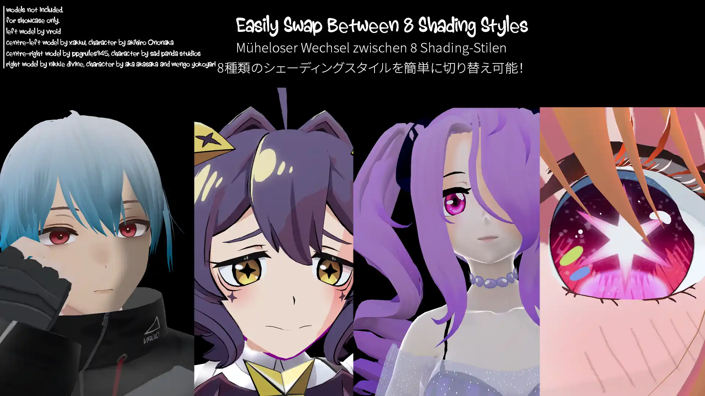
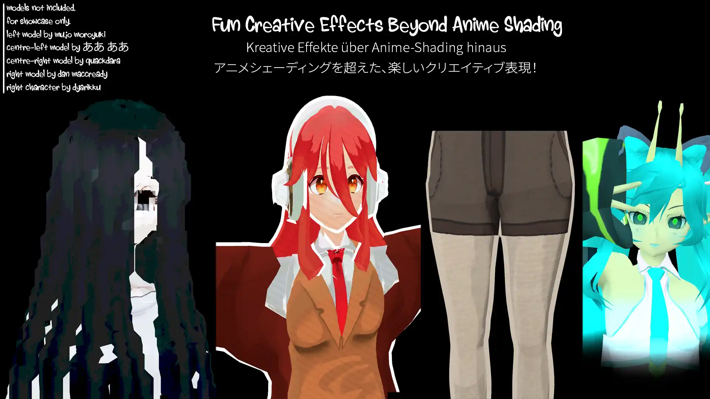
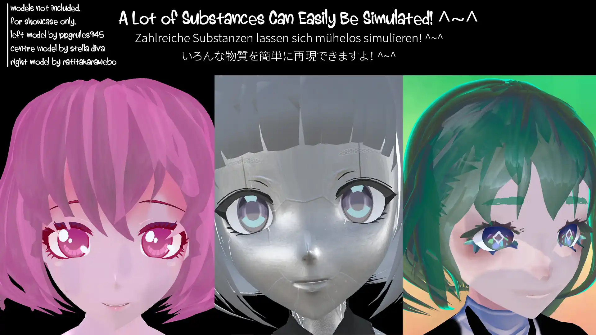
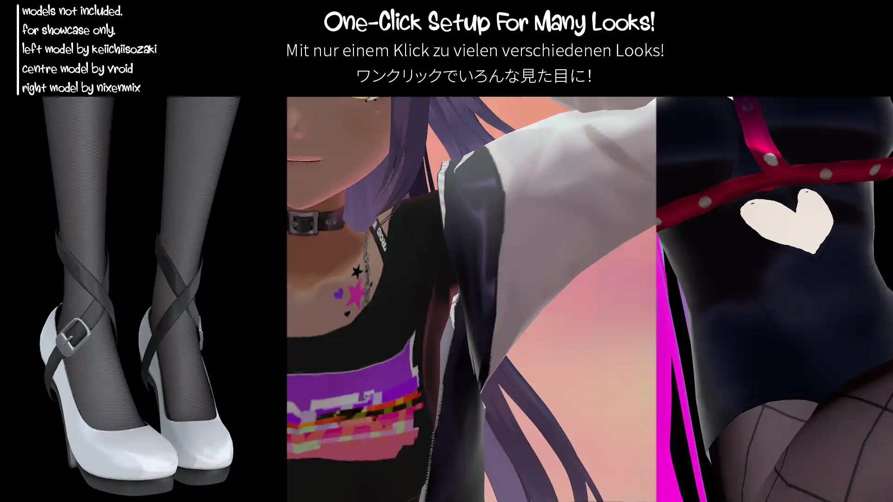
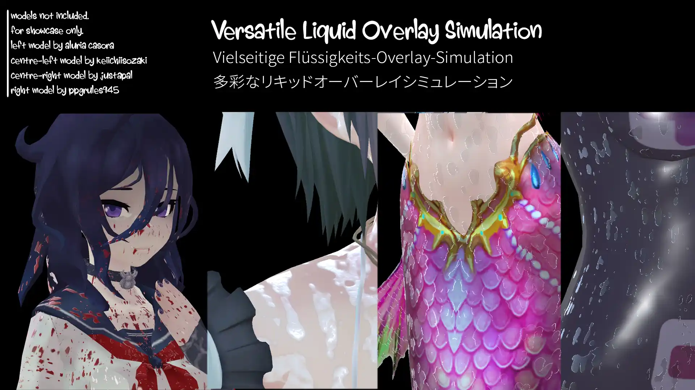

  

---

> *High heels, cute face, all the boys, they want a taste~*

Backlace 🎀 is a versatile anime (also called "toon", "cel shaded", or "npr") shader for Unity and VRChat. Backlace is packed with a wide range of features- from anime character shading, to screen-space rim lighting, to procedural glitter. Get started with a single click for a typical fully-lit anime character or dive deep into the advanced settings like Pathing and Liquid Layers! (─‿‿─)♡

**Latest Release:** 3.0.0 — see the [changelog](CHANGELOG.md) if you wish (｀・ω・´)ゞ
 
**Supported Platforms:** Unity Built-in Render Pipeline (BiRP), VRChat, Beatsaber, MateEngine, BepinEx Targetting BiRP, and more!
 
**Built With:** Unity 2022 LTS (but compatible with 2019.4+)
 
**Notice!!** It is best to download from [Releases](https://github.com/kleineluka/backlace/releases) or on another platform like [Gumroad](https://kleineluka.gumroad.com/l/backlace), because the Github Repo has many in-development settings on (ex. limited/no UI).

<h3>Click For Some Preview Images! (◕‿◕)♡</h3>

| Caption | Preview |
|---|---|
| Thumbnail |  |
| Styles #1 |  |
| Styles #2 |  |
| Styles #3 |  |
| Styles #4 |  |
| Creative Effects |  |
| Diagram View |  |
| Stickers |  |
| Substances |  |
| Materials |  |
| Liquids |  |

## Features 🍒
- **Main Settings:**
	- Rendering Presets/Control, VRChat Fallback, GI/GPU Instancing
	- Albedo, Normal (Supplied Map/Albedo Derived), Alpha Controls
	- Texture Stitching, Texture Post-Processing, Legacy Mode (for older hardware)
	- UV Effects (Triplanar, Screen, Spritesheet/Flipbook, Flow), UV Manipulation, Vertex Manipulation, 4 Assignable UV Sets
- **Anime Shading:** PBR, Ramp (Texutre/Procedural), Cel (Harsh/Default/Soft), NPR, Packed (Genshin/UmaMusume/GuiltyGear), TriBand, Skin, Wrapped
- **Lighting:** Extensive Control, Multiple Lighting Models, Manual Controls, Light Limiting, Attenuation Control, and Emission
- **Character Settings:** Ambient Gradient, Manual Normals, SDF Shadows, Stocking, Eye Parallax, Translucent Hair, Expression Map, Face Map, Gradient, Toon Highlights, Angel Rings (Hair), Quick Materials (Latex/Fabric/Silk/Rubber)
- **Specular:** Standard/Anisotropic, Vertex Specular, Energy Control
- **Stylise:** Rim Lighting (Fresnel/Depth/Normal), Clearcoat, Matcap, Parallax Mapping (UV/Layered/Interior), Subsurface Scattering, Detail Mapping, Shadow Mapping
- **Stickers:** Two Sticker Slots, UV/Triplanar/Screen Mapping, Hue Shift, Distortion, Glitch
- **Effects:** Dissolve (Noise/Directional/Voxel), Texture Pathing, Glitter, Distance Fading, Iridescence, Shadow Textures, Flatten Model, World Aligned Textures, VRChat Mirror Detection, Touch Interactions, Dithering, Low-Precision (PS1), Vertex Distortion (Distortion/Glitch), Refraction, Screen Space Reflections, Liquid Layer (Sweat/Blood/Oil/Icing/Slime/Wax/Mud)
- **World Building:** Stochastic Tiling (Triangle Grid/Contrast Aware), Splatter Mapping (Standard/Projection), Texture Bombing (Jittered/Layered)
- **Outline:** Outline/Silhouette Mode, Colour/Texture, Vertex Colour Masking
- **Third-Party Integrations:** LTCGI, Super Plug Shader, AudioLink

## Other Perks 😇
- **Variant Splitting:** Backlace is divided into multiple shaders so that you only need the performance cost of the features you need! You will find **Small**, **Default**, and **Full** versions of the shader alongside different features such as **Grabpass** or **Outline**.
- **Fair Keyword Usage:** Alongside variant splitting, some more expensive features are gated behind local shader features, so they won't ever touch performance if you aren't using them!
- **Fully Documented:** on my website at https://luka.moe/docs/backlace ~
- **Custom UI:** Pretty to look at, a search bar, custom settings, 9 languages, easily reset tabs and keep track of activated features.
- **Generate Compact Shaders:** Automatically make new shader files that strip any unused keywords from even being seen by the compiler.
- **Preset System:** Use built-in presets or make your own! Presets won't mess-up your main settings like the albedo texture, so you can experiment with different looks without losing your base material setup.

## Where Backlace Is Used 🍰
This section will be updated when I make things with it! If you make something with Backlace ~ whether a game or shader ~ please let me know so I can add it here! ♡＾▽＾♡

- The official distribution of Backlace itself! You can find it on [Gumroad](https://kleineluka.gumroad.com/l/backlace), [Jinxxy](https://jinxxy.com/luka/backlace), [Booth.pm](https://lukasong.booth.pm/items/7551840), and [Payhip](https://payhip.com/b/71i3E) (and on this repo).

If you wish to **make your own shader** with Backlace, please see [Contributing to Backlace](BUILDING.md) for more information! This is unnecessary if you just want to use Backlace as-is in your projects (ex. game developers, avatar creators, or world builders). ( *︾▽︾)

## License 🍷
Backlace is licensed under the Backlace License (Version 1.5). Please see the `LICENSE.md` file for the full terms.

**For Game Developers, VRChat Creators, and General Users —**
- You’re free to use Backlace in any project (personal or commercial) at no cost.
- Please give credit to “Backlace Anime Shader” somewhere in your project, whether that be in your README, credits, or simply in your code. You don't need to be super formal about it or fly a banner, I just enjoy seeing my what my work is used in! (◕‿◕)♡

**For Developers Building Off of Backlace —**
- You’re free to use Backlace in any project (personal or commercial) at no cost.
- Anything you sell with Backlace must be transformative (adding significant new features or creativity). You can’t just rebrand or resell Backlace as-is.
- You must credit “Backlace” somewhere visible in your shader's user interface (like a credits section or footer) with a link to the official GitHub page.
- Please avoid modifying/redistributing files in the `Editor` and `Processor` folders in your project as those are not intended to be built off of. This doesn't apply to anybody using Backlace as-is in their projects.

If you’re unsure whether your use fits the license or just want to talk about it, feel free to reach out! 💗

## Attributions ❤️‍🔥
- This shader was originally a fork of the [Toony Standard Rebuild](https://github.com/VRLabs/Toony-Standard-Rebuild) shader by VRLabs, which is under the MIT license. However, essentially all of that code has been replaced, removed, or rewritten. **No bugs for Backlace should be reported to them.**
- Various lighting modes are derived from other projects, specifically [Poiyomi Toon](https://github.com/poiyomi/PoiyomiToonShader), [lilToon/OpenLit](https://github.com/lilxyzw/lilToon), and [Mochies Unity Shaders](https://github.com/MochiesCode/Mochies-Unity-Shaders/). Thesse are all under the MIT license and code references are limited to lighting modes with those names (ex. \"Poi Custom\", \"OpenLit\", \"Mochies\").
- The \"Flatten Model\" effect is inspired directly by [Lyuma's Waifu2D Shader](https://github.com/lyuma/LyumaShader), which is under the MIT license. Please note Backlace's implementation is simplified and their code is better if a flat model is *purely* the goal of your project!
- Original inspiration for the Raymarched SSR feature came from [orel1's SSR module](github.com/orels1/orels-Unity-Shaders), which is an implementation of [Mochie's](https://github.com/MochiesCode/Mochies-Unity-Shaders/) fork of ERROR.mdl's SSR. Both are under MIT licenses. While Backlace's idea stemmed from there, the implementation here is much simpler and modified.
- [UmaShader](https://github.com/Sneppys/UmaShader), [Arc Systems Work for Unity](https://github.com/Aerthas/UNITY-Arc-system-Works-Shader), [StarRailNPRShader](https://github.com/stalomeow/StarRailNPRShader) and [HoyoToon](https://github.com/Hoyotoon/HoyoToon) were referenced for what packed texture channels contain for their respective models and shading techniques (ex. stockings, shadow pushing) used in the games for a few settings. All are under the GPLv3 license.
- AudioLink features, and a lot of the boilerplate code in `Backlace_AudioLink.cginc`, are from [AudioLink](https://github.com/llealloo/audiolink), which is under a modified MIT license.
- Third-party features such as [LTCGI](https://github.com/PiMaker/ltcgi) and [Super Plug Shader](https://vrcfury.com/sps/) are unassociated projects, under their own licenses, and require separate installation.
- Default textures (ex. ramps and noises) are from a variety of sources online, notably [Perlin Noise Maker](http://kitfox.com/projects/perlinNoiseMaker/), [OpenGameArt](https://opengameart.org/), and [Booth Matcap Pack 2](https://booth.pm/ja/items/5755167).
- The name is inspired by a certain vulgar and promiscious angel. (｡♥‿♥｡)